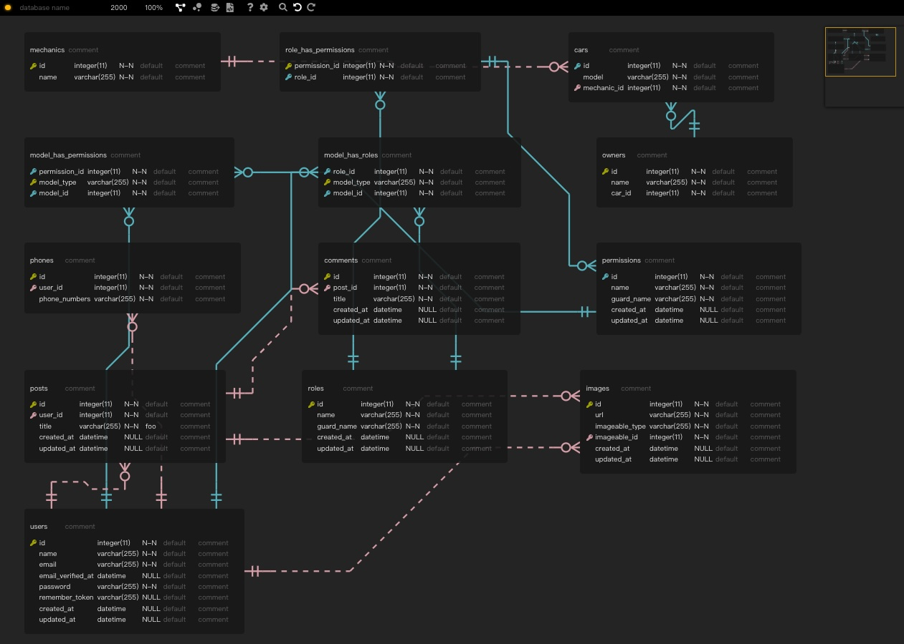
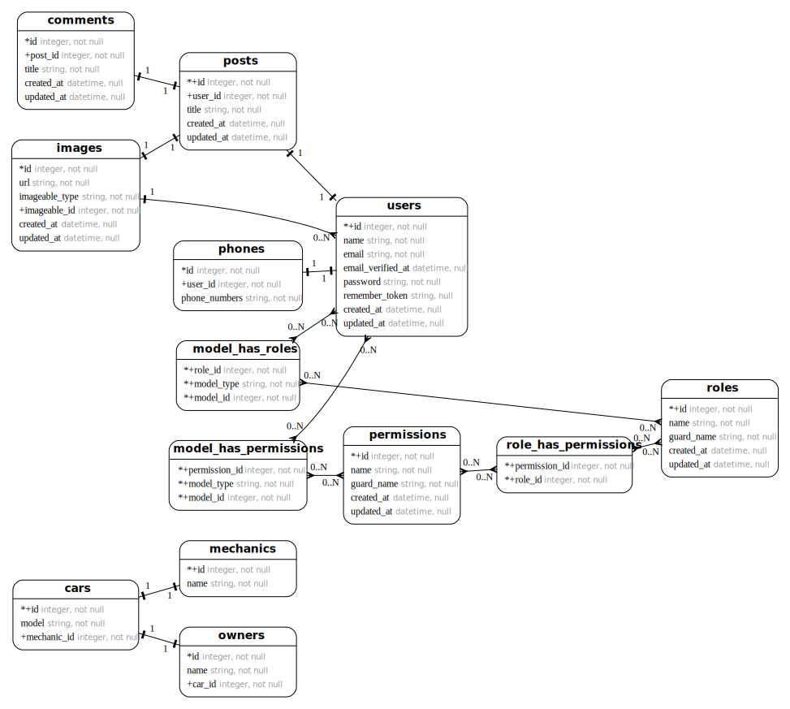

# Laravel ERD

[](https://packagist.org/packages/recca0120/laravel-erd)
[](https://github.com/recca0120/laravel-erd/actions?query=workflow%3Arun-tests+branch%3Amain)
[](https://packagist.org/packages/recca0120/laravel-erd)

Laravel ERD automatically generates Entity-Relationship Diagrams from your Laravel models and displays them
using [Vuerd](https://github.com/dineug/erd-editor).

## Preview

Here's a sample of what you can expect, generated from [migrations](database/migrations)
and [models](tests/Fixtures/Models):

> [View Live Demo](https://previewhtml.github.io/?url=https%3A%2F%2Fgithub.com%2Frecca0120%2Flaravel-erd%2Fblob%2Fmain%2Fdemo%2Findex.html)



## Requirements

| Lang    | Version                 |
|:--------|:------------------------|
| PHP     | 7.4, 8.0, 8.1, 8.2, 8.3 |
| Laravel | 8, 9, 10, 11            |

## Installation

Install the package via Composer:

```bash
composer require recca0120/laravel-erd:^0.1 --dev
```

## Usage

### Step 1: Generate the ERD

Run the following command:

```bash
php artisan erd:generate
```

Step 2: View the ERD

Open the following URL in your browser:

http://localhost/laravel-erd

## Advanced Usage

### Exclude Tables and Save to a Different Filename

#### step 1.

Run the command:

```bash
php artisan erd:generate --file=exclude-users.sql --exclude=users
```

#### step 2.

Open the URL:

http://localhost/laravel-erd/exclude-users

### Generate an SVG Version

#### step 1.

Install [erd-go](https://github.com/kaishuu0123/erd-go)
and [graphviz-dot.js](https://github.com/kaishuu0123/graphviz-dot.js) using:

```bash
php artisan erd:install 
```

#### step 2.

Generate the SVG file:

```php
php artisan generate --file=laravel-erd.svg
```

#### step 3.

View the SVG version:

http://localhost/laravel-erd/laravel-erd.svg



> The SVG file can be found at storage/framework/cache/laravel-erd.

Feel free to ask if you have any questions or need further assistance!