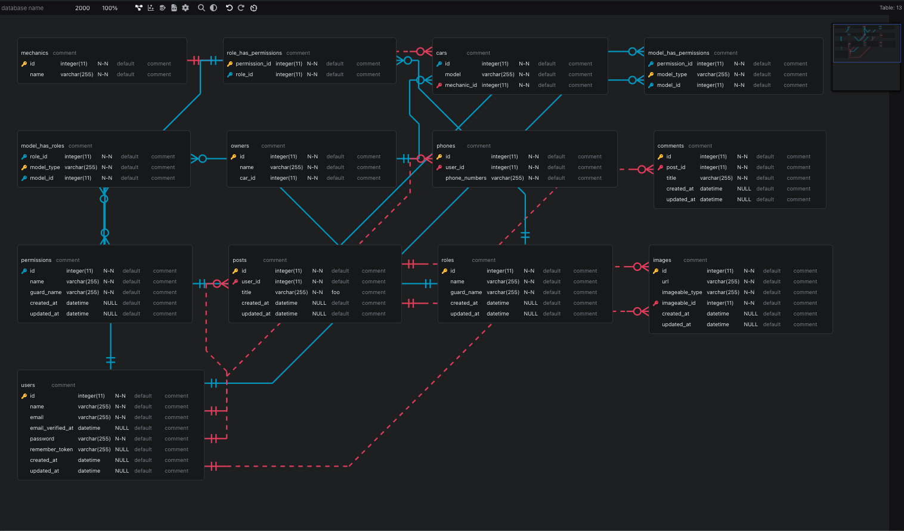
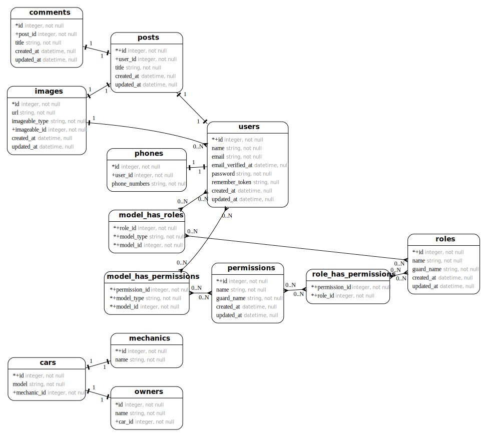

# Laravel ERD

[](https://packagist.org/packages/recca0120/laravel-erd)
[](https://github.com/recca0120/laravel-erd/actions?query=workflow%3Arun-tests+branch%3Amain)
[](https://packagist.org/packages/recca0120/laravel-erd)

[English](README.md)

Laravel ERD 可以從 Laravel Eloquent Model 自動產生實體關聯圖（ER Diagram）。**不需要實際的資料庫連線** — 預設使用記憶體內的 SQLite 資料庫，因此可以在任何環境產生 ERD，包括 CI/CD 流程。

產生的結果透過互動式的 [erd-editor](https://github.com/dineug/erd-editor) 網頁元件呈現，也可以匯出為 SVG。

## 預覽

> [查看線上 Demo](https://rawcdn.githack.com/recca0120/laravel-erd/c936d64543139b70615333c833077a0076949dc8/demo/index.html)



## 系統需求

| 項目    | 版本               |
|:--------|:-------------------|
| PHP     | 8.1, 8.2, 8.3, 8.4 |
| Laravel | 8, 9, 10, 11, 12   |

## 安裝

```bash
composer require recca0120/laravel-erd --dev
```

## 快速開始

### 1. 產生 ERD

```bash
php artisan erd:generate
```

這會掃描 `app/` 目錄的 Eloquent Model，在記憶體內的 SQLite 資料庫執行 Migration，然後產生 `.sql` DDL 檔案。

### 2. 在瀏覽器中檢視

開啟以下網址：

```
http://localhost/laravel-erd
```

互動式編輯器支援深色模式、自動排版及主題建構器。

## 輸出格式

輸出格式由 `--file` 的副檔名決定：

| 副檔名   | 格式             | 說明                                                 | 需要安裝二進位檔 |
|:---------|:-----------------|:-----------------------------------------------------|:---------------|
| `.sql`   | SQL DDL          | CREATE TABLE 和 ALTER TABLE 語句（預設）                | 否             |
| `.svg`   | SVG 圖表         | 可縮放的視覺化圖表，支援縮放/平移                          | 是             |

### 產生 SVG

SVG 輸出需要 `erd-go` 和 `graphviz-dot` 二進位檔。用以下指令安裝：

```bash
php artisan erd:install
```

然後產生：

```bash
php artisan erd:generate --file=erd.svg
```

瀏覽：`http://localhost/laravel-erd/erd.svg`



## 指令選項

```bash
php artisan erd:generate {database?} {--directory=} {--file=} {--path=} {--regex=} {--excludes=} {--graceful}
```

| 選項             | 說明                                              | 預設值             |
|:----------------|:--------------------------------------------------|:------------------|
| `database`      | 要使用的資料庫連線名稱                                | 設定檔中的 `database.default` |
| `--directory`   | 掃描 Eloquent Model 的目錄                          | `app/`            |
| `--file`        | 輸出檔名（副檔名決定格式）                             | `{database}.sql`  |
| `--path`        | Migration 路徑（傳遞給 `artisan migrate`）            | —                 |
| `--regex`       | 檔案比對模式                                         | `*.php`           |
| `--excludes`    | 以逗號分隔的排除資料表名稱                              | —                 |
| `--graceful`    | 發生錯誤時印出錯誤訊息而非拋出例外                        | `false`           |

### 範例

```bash
# 基本產生
php artisan erd:generate

# 排除特定資料表
php artisan erd:generate --file=clean.sql --excludes=jobs,failed_jobs,cache

# 掃描特定目錄
php artisan erd:generate --directory=app/Models

# 產生 SVG
php artisan erd:generate --file=diagram.svg

# 使用不同的資料庫連線
php artisan erd:generate mysql

# 印出錯誤訊息而非拋出例外
php artisan erd:generate --graceful
```

## 支援的關聯類型

Laravel ERD 可偵測以下 Eloquent 關聯：

- `BelongsTo`
- `HasOne` / `HasMany`
- `BelongsToMany`
- `MorphOne` / `MorphMany` / `MorphTo` / `MorphToMany`
- [Compoships](https://github.com/topclaudy/compoships)（複合鍵關聯）

## 設定

發布設定檔：

```bash
php artisan vendor:publish --provider="Recca0120\LaravelErd\LaravelErdServiceProvider"
```

這會建立 `config/laravel-erd.php`：

```php
return [
    // 網頁檢視器的路由 URI
    'uri' => env('LARAVEL_ERD_URI', 'laravel-erd'),

    // 產生的檔案儲存位置
    'storage_path' => storage_path('framework/cache/laravel-erd'),

    // 預設輸出副檔名（未指定 --file 時使用）
    'extension' => env('LARAVEL_ERD_EXTENSION', 'sql'),

    // 網頁檢視器的 Middleware
    'middleware' => [],

    // erd-go 和 graphviz-dot 二進位檔路徑
    'binary' => [
        'erd-go' => env('LARAVEL_ERD_GO', '/usr/local/bin/erd-go'),
        'dot' => env('LARAVEL_ERD_DOT', '/usr/local/bin/dot'),
    ],

    // 各連線的資料庫覆蓋設定（詳見下方說明）
    'connections' => [],
];
```

### 自訂輸出路徑

預設產生的檔案儲存在 `storage/framework/cache/laravel-erd/`。若要將 ERD 儲存為專案文件：

```php
'storage_path' => base_path('docs/erd'),
```

### 網頁檢視器 Middleware

在正式環境保護網頁檢視器：

```php
'middleware' => ['auth'],
```

### 各連線的資料庫覆蓋設定

預設情況下，ERD 產生時**所有**資料庫連線都會被替換為記憶體內的 SQLite。這代表您不需要執行中的資料庫伺服器。

如果需要讓特定連線使用真實資料庫（例如需要特定資料庫的欄位類型），可以進行覆蓋：

```php
'connections' => [
    'mysql' => [
        'driver' => 'mysql',
        'host' => env('DB_HOST', '127.0.0.1'),
        'port' => env('DB_PORT', '3306'),
        'database' => env('DB_DATABASE', 'forge'),
        'username' => env('DB_USERNAME', 'forge'),
        'password' => env('DB_PASSWORD', ''),
        'charset' => 'utf8mb4',
        'collation' => 'utf8mb4_unicode_ci',
        'prefix' => '',
    ],
],
```

**未列出**的連線將繼續使用預設的記憶體內 SQLite。

## 運作原理

1. **備份** — 儲存目前的資料庫和快取設定
2. **覆蓋** — 所有連線替換為記憶體內 SQLite（除非在設定中覆蓋）
3. **Migration** — 執行 `artisan migrate` 建立 Schema
4. **掃描** — 使用 `nikic/php-parser` 在目標目錄尋找 Eloquent Model
5. **分析** — 透過檢查 Model 方法來探索關聯
6. **產生** — 以指定格式輸出 ERD
7. **還原** — 恢復原始資料庫設定

您的實際資料庫不會被修改。

## 可發布的資源

```bash
# 發布全部（設定、View、前端資源）
php artisan vendor:publish --provider="Recca0120\LaravelErd\LaravelErdServiceProvider"
```

| 資源             | 目的地                                    |
|:----------------|:-----------------------------------------|
| 設定檔           | `config/laravel-erd.php`                 |
| View            | `resources/views/vendor/laravel-erd/`    |
| 前端資源         | `public/vendor/laravel-erd/`             |

## 授權

MIT 授權。詳見 [License File](LICENSE)。
